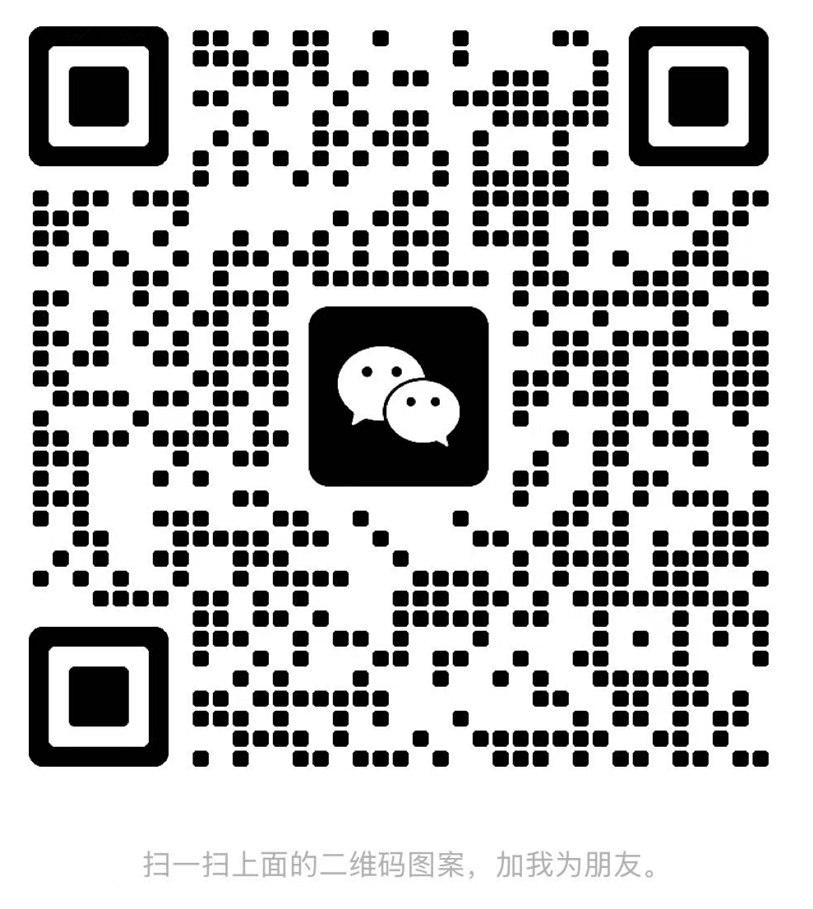

# README

# 游戏UITA

游戏UITA的学习路线+一些经验分享和自己整理官方文档后的教程。

## UGUI-线路图

通过两个目标：上岗~晋升来划分路线  
​

## 学习目录

### 食用指南

阅读：[全文说明](全文说明.md)

对文档全部内容的作用进行概括说明。

### Unity基础

阅读：[概览 - Unity基础](概览%20-%20Unity基础.md)

#### 学习UI组件

- [可视组件](可视组件.md)
- [交互组件](交互组件.md)
- [布局组件](布局组件.md)
- [动效组件](动效组件.md)

### 项目知识

阅读：[概览 - 项目知识](概览%20-%20项目知识.md)

#### 学习项目知识

- [资产管理](资产管理.md)
- [经验和规范](经验和规范.md)
- [渲染相关](渲染相关.md)

### 进阶学习

阅读：[概览 - 案例说明](概览%20-%20案例说明.md)

内容筹备中...

#### 案例说明

#### 编辑器拓展

---

# 联系方式

### 微信

有需要行业内推资格或其他咨询合作都可以进行联系。

> 注意：一定要备注，否则会被忽略的。

​

### 讨论群

暂未创建，可以先加微信，等大家都有讨论需求了，进行整理拉群。

---

# 协议说明

发布协议为 CC-BY-NC-SA4.0

中文说明：[creativecommons.org/licenses/by-nc-sa/4.0/deed.zh-hans](https://creativecommons.org/licenses/by-nc-sa/4.0/deed.zh-hans)

您可以自由地：

共享 — 在任何媒介以任何形式复制、发行本作品

演绎 — 修改、转换或以本作品为基础进行创作

只要你遵守许可协议条款，许可人就无法收回你的这些权利。

惟须遵守下列条件：

署名 — 您必须给出 适当的署名 ，提供指向本许可协议的链接，同时 标明是否（对原始作品）作了修改 。您可以用任何合理的方式来署名，但是不得以任何方式暗示许可人为您或您的使用背书。

非商业性使用 — 您不得将本作品用于 商业目的 。

相同方式共享 — 如果您再混合、转换或者基于本作品进行创作，您必须基于 与原先许可协议相同的许可协议 分发您贡献的作品。

没有附加限制 — 您不得适用法律术语或者 技术措施 从而限制其他人做许可协议允许的事情。

声明：

您不必因为公共领域的作品要素而遵守许可协议，或者您的使用被可适用的 例外或限制 所允许。

不提供担保。许可协议可能不会给与您意图使用的所必须的所有许可。例如，其他权利比如 形象权、隐私权或人格权 可能限制您如何使用作品。

<a href="https://creativecommons.org">game-uita-101</a> © 2025.8.24 by <a href="https://creativecommons.org">ChinKeni</a> is licensed under <a href="https://creativecommons.org/licenses/by-nc-sa/4.0/">CC BY-NC-SA 4.0</a>