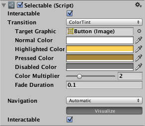
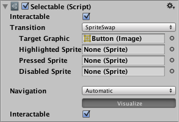
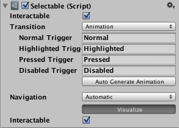

# 可选基类 ／交互基类 (Selectable Base Class)

> 参考 [可选基类 (Selectable Base Class)](https://docs.unity3d.com/cn/2023.2/Manual/script-Selectable.html "可选基类 (Selectable Base Class)") 官方文档。
>
> 前置知识： [可视组件](可视组件.md) 、[动效组件](动效组件.md)。
>
> 官方翻译是可选基类，我这里为了方便理解称呼 `交互基类` ；

​`交互基类` 是所有交互组件的基类，可处理共同的项。

初学者需要掌握配置 [状态](#20250815013918-filj2nt)、[Transition](#20250815014037-79zigo7)，状态和表现配置部分。

## 构成参数

### **Interactable**

​`可交互` - 默认是可交互，如果设置不可交互，`Transition` 会切换到Disable，如果是装饰用来提示滚动范围时，可以把 `Disable` 当 `Normal` 参数设置。

‍

---

### **Transition**

​`过渡表现` - 有几个表现选项可选。选择后需要设置不同的 [状态](#20250815013918-filj2nt) 包括：正常、突出显示、按下和禁用。

#### None

​`无效` - 就是啥效果都没有。

#### Color Tint

​`染色` - 这里设置的颜色不是覆盖而是乘上去的，乘的是设置的比值，比如明暗是V=50，总值100，当前色的B*0.5就是结果。

##### -**Target Graphic**

​`目标图形` - 用来染色的图形。

##### -* Color

​`状态颜色` - 用来设置状态的染色参数。

##### -ColorMultiplier

​`色彩倍增` - 允许比原有色彩更亮的处理方法。

##### -FadeDuration

​`过渡时间` - 颜色变化的过渡时间。

#### Sprite Swap

​`图片切换` - 根据设置的 `Sprite/图片/精灵` 切换显示。

##### -**Target Graphic**

​`目标图形` - 用来换图的图形。

‍

#### Animation

​`动画` - 虽然是写作 `Animation` ，实际上资产用的是 `状态机（Animator）`。

##### -* Trigger

​`状态触发器` - 用来设置播放的动画触发器。

‍

---

### **Navigation**

​`导航` - 用作导航焦点的配置，键盘的焦点切换，也可以用来作为手柄焦点的处理。

#### None

​`无效` - 没有导航。

#### Horizontal

​`水平` - 水平方向导航，锁定导航方向用的。

#### Vertical

​`垂直` - 垂直方向导航，锁定导航方向用的。

#### Automatic

​`自动` - 自动导航，这个最常用。

#### Explicit

​`显式` - 主动配置导航方向，自定义的时候用。

#### **Visualize**

​`可视化` - 开启后，把导航线展示出来。

‍

---

## 状态

​`Transition` 在设置后会有对应的状态设置，根据不同类型对应不同的设置，但是状态都是以下这组。

### Normal

​`常态` - 表示默认状态。

### Highlighted

​`高亮` - 控件突出时候的状态，通常是鼠标滑上去的表现。

### Pressed

​`按下` - 交互时候按下的状态，鼠标和触摸都生效。

### Disable

​`禁用` - 禁止交互的状态。

‍
