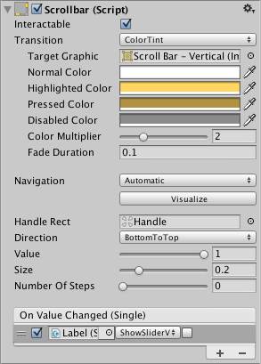
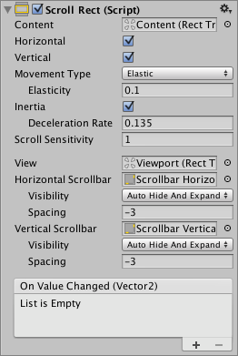
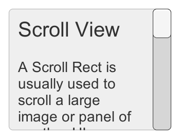

# 滚动矩形／滚动视图 (Scroll Rect／Scroll View)

> 参考 [滚动条 (Scrollbar)](https://docs.unity3d.com/cn/2023.2/Manual/script-Scrollbar.html) 、 [滚动矩形 (Scroll Rect)](https://docs.unity3d.com/cn/2023.2/Manual/script-ScrollRect.html) 官方文档。
>
> 前置知识： [可选基类 ／交互基类 (Selectable Base Class)](可选基类%20／交互基类%20(Selectable%20Base%20Class).md) 、 [遮罩(Mask)](可视组件/遮罩(Mask).md) 内容。

## 滚动条 (Scrollbar)

因为这个基本可以说是绑定给 `滚动视图` 使用，所以内容合并起来讲解。

### 图示

### 核心参数

[可选基类 ／交互基类 (Selectable Base Class)](可选基类%20／交互基类%20(Selectable%20Base%20Class).md)

#### **Handle Rect**

​`控制柄` - 用于控件滑动的图形。

#### **Direction**

​`方向` - 拖动 `控制柄` 的方向。

‍

### 可配参数

一般不配置的参数。

#### **Value**

​`值` - 范围 0.0~1.0，滑动后会变更的值。

#### **Size**

​`尺寸` - 范围 0.0~1.0，通常由Content变化后自己计算的。

#### **Number Of Steps**

​`步长` - 每次操作滚动条的步长。

‍

---

## 滚动矩形 (Scroll Rect)

### 图示

‍

### 核心参数

#### **Content**

​`内容` - 用来承载滚动的内容

#### **Horizontal/Vertical**

​`方向` - 水平还是垂直滚动

#### **Viewport**

​`边界` - `内容` 可以滑动的边界限制，官方默认结构下 `Mask` 是放在这层的，实际上非必须有特殊应用可以放别的位置。

#### **Horizontal/Vertical** **Scrollbar**

​`滚动条` - 通常根据滑动方向来设置对应的滑动条。

##### -**Visibility**

​`可视状态` - 用来设置滚动区域如果能全显示的时候，应该处于什么状态

​*​`Permanent:`​*  永久的显示不隐藏

​*​`Auto Hide:`​*  自动隐藏，不做其他处理

​*​`Auto Hide And Expand Viewport:`​*  自动隐藏并且扩展 `边界` ，并且开启 `Spacing` 参数，根据这个参数，内容全显时给出更大 `边界` 且隐藏掉滚动条，但内容会跳变，且 `Viewport` 会被限制设置宽高。

##### -**Spacing**​

​`间隔` - 用来扩展Viewport的，特殊情况使用，大多数其实不用这个模式。

‍

### 手感参数

#### **Movement Type**

​`移动方式` - 用于设置滑动的时候容器表现。

​*​`Unrestricted:`​*  不受管控，内容可以随便拖拽出去，没边界

​*​`Elastic:`​*  反弹模式，在边界的时候可以拉动反弹，很常用

​*​`Clamped:`​*  到边界的时候就无法向外拖拽了

##### - **Elasticity**

​`MovementType` 设置成 `Elastic` 的时候，开启参数，设置反弹量。

#### **Inertia**

​`惯性` - 一般为了手感都是要调这个的。

##### -**Deceleration Rate**

​`阻力` - 速率为 0 将立即停止移动。值为 1 表示移动永不减速。

#### **Scroll Sensitivity**

​`滚动反馈` - 对滚轮和触控板滚动事件的敏感性。0为不接受反馈，数字越大模拟的滑动力道越强。

‍
