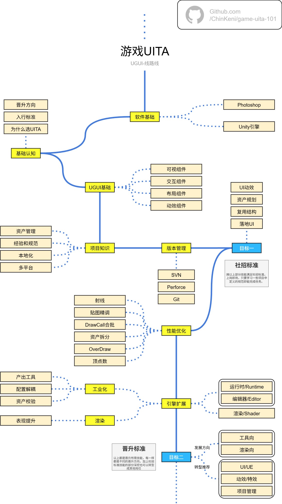

# 全文说明

游戏UITA的学习路线+一些经验分享和自己整理官方文档后的教程。

## 路线图

通过两个目标：上岗~晋升来划分路线

因官方文档的写作方向都是以全面覆盖来写，所以存在很多复杂的知识点，新人不用关注的内容，很多止步于官方文档的原因都是因此而起。

所以本文库目标是为了给Unity初学者提供学习路径和未来方向的指引，如果已经有相应技术的可以跳过对应章节，直接全文查找自己所需要的知识，当做参考手册也是可以的。

> **提醒**
>
> 初衷是以速成学习进行编排，为了让初学者快速掌握项目落地的基础技能，更深层次的技能将会以其他的文库进行展开讲解。

## Unity基础

习惯于从细节学习后再融入案例应用的可以从这里开始看 [概览 - Unity基础](概览%20-%20Unity基础.md) ,文档从组件构成来说明如何使用。

## 项目知识

有Unity基础知识后可以学习一些项目内的资产构成，应用经验和规范等等，从 [概览 - 项目知识](概览%20-%20项目知识.md) 中查看。

## 案例说明

喜欢从案例说明推导需要知识点的也可以从 [概览 - 案例说明](概览%20-%20案例说明.md) 中学习，每个案例也会标注所需知识，根据内容所需知识可以跳转到对应文档中学习。

## 构成说明

### 工作必须

掌握基本知识，引擎、常见的资源处理方法、框架等等，内容尽量覆盖到日常工作所需的高频知识。

### 进阶学习

以一些案例说明的方式去结合基础知识构建应用，直观的展示如何使用组件中的参数组合。

除了以上的落地相关知识，这里会提供一些其他职业方向和技能，点到为止，作为敲门砖，如后续有机会可以在其他文库中展开相对系统的教学。

‍

## 项目路径

分享 [Github - game-uita-101](https://github.com/ChinKeni/game-uita-101)

‍
