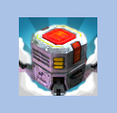
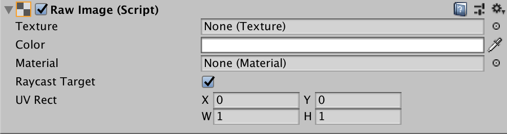

# 元图(RawImage)

> 参考官方 [原始图像 (Raw Image)](https://docs.unity3d.com/cn/2023.2/Manual/script-RawImage.html) 文档。

## 表现

## 参数窗口

## 核心参数

### **Texture**

​`贴图` - 用于显示的图像贴图，区别于 `图像(Image)` 可以使用任何类型的贴图。

### **Color**

​`颜色` - 用来对图片染色。

### **Material**

​`材质` - 对图做特殊表现。

### **Raycast Target**

​`射线` - 用来交互的，一般都是用来给交互组件做响应的，默认最好是关掉。

### UV **Rectangle**

​`UV矩形空间` - 图像在控件中的偏移和大小，以标准化坐标（范围 0.0 到 1.0）表示。图像边缘将进行拉伸来填充 UV 矩形周围的空间。常用的作用是 四方连续图的平铺，以及一些对称大图的镜像处理。

‍
