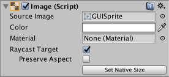
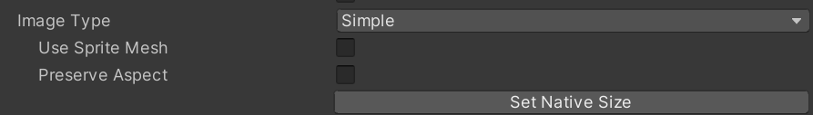
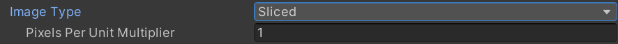
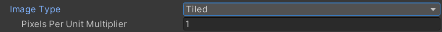
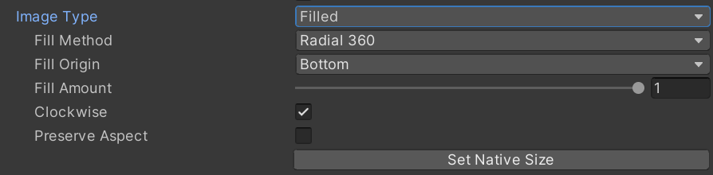
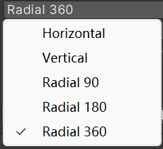

# 图像(Image)

> 参考官方 [图像 (Image)](https://docs.unity3d.com/cn/2023.2/Manual/script-Image.html) 文档。

## 表现

## 参数窗口

## 核心参数

### **Source Image**

​`源图` - 显示的图像的纹理（必须作为 `精灵(Sprite)`）- [贴图导入设置](资产管理/贴图相关/贴图导入设置.md)。

### **Color**

​`颜色` - 用来对图片染色。

### **Material**

​`材质` - 对图做特殊表现。

### **Raycast Target**

​`射线` - 用来交互的，一般都是用来给交互组件做响应的，默认最好是关掉。

### **Preserve Aspect**

​`保持比例` - 保持原来的宽高比，用来拉伸适配的时候很好用

### **Set Native Size**​

​`还原尺寸` - 用于主动触发还原图片尺寸，会因 `Sprite` 设置的 `PPU` （[Pixels Per Unit](资产管理/贴图相关/贴图导入设置.md#20250831133615-gcqncra)）参数设置不同的组件尺寸。

‍

### ImageType

​`图片类型` - 切换图片的显示类型。

#### Simple

​`常规` - 常规的，默认类型

##### -Use Sprite Mesh

​`使用图片网格` - Png的图使用 `精灵(Sprite)` 设置的Mesh，而不是组件作为一个Mesh框，合理应用的话和性能设置有关。

‍

#### Sliced

​`拉伸` - 九宫格，很常用，节省资产。

##### -PixelsPerUnitMultiplier

​`像素单位倍率` - 作用是把四周不拉伸区域按照倍率放大缩小，可以处理一些圆角矩形。

‍

#### Tiled

​`平铺` - 用来做四方连续的。

##### -PixelsPerUnitMultiplier

​`像素单位倍率` - 对平铺内容进行倍率缩放，不用动刀布局组件，这里不展开说。

‍

#### Filed

​`填充` - 通过设置隐藏掉图片的一部分。

##### -Fill Method

​`填充模式` - 显示的方向

##### -Fill Origin

​`填充圆心` - 就是从哪开始

##### -Fill Amount

​`填充量` - 从0到1。

##### -Clockwise

​`顺时针` - 使用顺时针方向。

---

## 7关联知识

需要接触到Sprite相关知识才能了解九宫格、平铺的相关知识。这部分是资产的知识点。可以阅读贴图的 [贴图导入设置](资产管理/贴图相关/贴图导入设置.md) 、 [精灵图集(Sprite Atlas)](资产管理/贴图相关/精灵图集(Sprite%20Atlas).md)文档。

‍

‍
