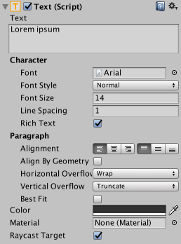
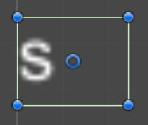
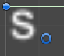
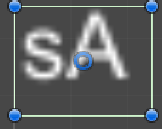

# 文本(Text)

> 参考官方 [文本(Text)](https://docs.unity3d.com/cn/2023.2/Manual/script-Text.html "文本(Text)") 文档。

## 参数窗口

## 核心参数

### Text

​`内容` - 填写的内容可以直接反馈在场景中，也是核心。

### Font

​`字体` - 用来选择一个想被渲染显示的字体包。

### FontStyle

​`风格` - 字体包里如果有其他的风格，加粗什么的都是用这个设置的。

### FontSize

​`字号` - 用来设置字体需要显示的大小。

### LineSpacing

​`行间距` - 文本换行后的间距。

### RichText

​`富文本` - 参考官方的[富文本](https://docs.unity3d.com/cn/2023.2/Manual/StyledText.html "富文本")文档，一般是策划来配置的。

‍

## 段落参数

### Alignment

​`对其` - 这个美术应该很熟悉，分别是左中右，上中下对其。

### AlignByGeometry​​​

​`字形对其` - 就是文本字多大，就用这个文本实际表现的边缘对其。

未开：使用文本框对其，可以理解成最大字体的边缘大小。

开启：根据内容里的文字边缘对其。

不建议使用情况：文本如果会变化的情况，可能产生跳动问题。

### **Horizontal Overflow**

​`水平溢出` - 超出限定范围时候的处理参数

*Warp*：换行处理，一般使用这个。

*Overflow：溢出，这个很少使用，容易不可控。*

### **Vertical Overflow**

​`垂直溢出`-超出限定范围时候的处理参数

​*​`Truncate:`​*  截断，一般使用这个。

​*​`Overflow:`​* ​ *这个偶尔会用，比如确定为单行文本下，又担心文本因分辨率变化导致的细微超出不显示，可以用。*

### **Best Fit**

​`适配文本`-当宽高都没有空间放入的时候，会根据设置的字号参数区间调整，一般多语言很常用。

### **Color**

​`颜色` - 设置文本的字色。

### **Material**

​`材质 `- 常规下一般不会去使用。

---

## 关联知识

### 字体样式

经常会与 [阴影 (Shadow)](网格效果(BaseMeshEffect)/阴影%20(Shadow).md)  [轮廓 (Outline)](网格效果(BaseMeshEffect)/轮廓%20(Outline).md) 一起使用，不过存在性能消耗，有部分项目会用自己写的材质球处理。

渐变字体可以使用顶点着色的方式处理，这里不展开说明。

### 新版Text

> 参考 [TextMesh Pro用户指导](https://docs.unity3d.com/Packages/com.unity.textmeshpro@3.0/manual/index.html) 官方文档。

因为对中文的支持不是那么好，使用起来对策划文本管理要求比较高，很多项目并不使用，并且字体效果也不是很好，常用于数字/独立游戏。

数字可以使用这个做一些表现效果比较合适。

### 本地化支持

正式项目会需要对本地化支持，除非不做全球发行，一般会继承这个组件做修改，通常为文本ID的形式进行配置，会区分静态和动态文本之分，这个额外 [本地化](经验和规范/本地化.md) 文档会展开讲。

‍
