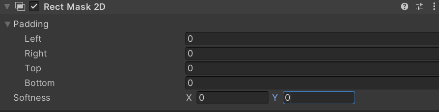

# 矩形遮罩(RectMask2D)

> 参考 [矩形遮罩(RectMask2D)](https://docs.unity3d.com/cn/2023.2/Manual/script-RectMask2D.html) 官方文档。

是一个类似于 [遮罩(Mask)](遮罩(Mask).md) 控件的遮罩控件。遮罩将子元素限制为父元素的矩形。与标准的遮罩控件不同，这种控件有一些限制，但也有许多性能优势。

## 参数窗口

## 核心参数

### Padding

​`填充` - 调整遮罩的作用区域，可以填负数实现特殊的遮罩效果。

### Softness

​`虚化` - 根据设置的方向虚化遮罩内容。

‍
