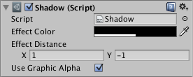

# 阴影 (Shadow)

> 参考官方 [阴影 (Shadow)](https://docs.unity3d.com/cn/2023.2/Manual/script-Shadow.html "文本(Text)") 文档。

## 表现

​

## 参数窗口

## 核心参数

### **Effect Color**

​`效果色` - 阴影的颜色。

### **Effect Distance**

​`效果距离` - 阴影的距离。

### **Use Graphic Alpha**

​`使用图形透明度` - 将图形的透明度叠加到效果颜色上。是否被  `图像(Image)` 的 `颜色` 参数的透明度影响。

‍
