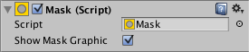

# 遮罩(Mask)

> 参考官方 [遮罩(Mask)](https://docs.unity3d.com/cn/2023.2/Manual/script-Mask.html) 文档。

## 参数窗口

## 核心参数

### **Show Mask Graphic**

​`显示遮罩图`​ - 是否把作为遮罩的 `图像(Image)` 给显示出来。

---

## 关联知识

### 表现

​`遮罩(Mask)` 不带透明区的处理，所以如果有透明区的需求需要额外进行开发。

### 性能

在特别关注性能损耗的项目中，需要了解这种 `遮罩(Mask)`​ 的实现是用的模板缓冲区来实现。如果只是对一个矩形区进行遮罩，有一个更高性能且好用的 [矩形遮罩(RectMask2D)](矩形遮罩(RectMask2D).md) 可以选择。
