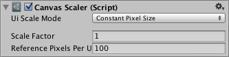
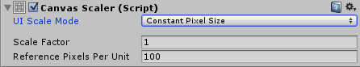
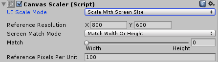
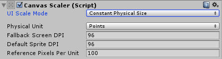

# 画布缩放器 (Canvas Scaler)

> 参考官方 [画布缩放器 (Canvas Scaler)](https://docs.unity3d.com/cn/current/Manual/script-CanvasScaler.html) 文档。
>
> 前置知识： [Sprite(2D and UI)](../../资产管理/贴图相关/贴图导入设置.md#20250831115115-z0go7o1)。

画布缩放器组件用于控制画布中 UI 元素的整体缩放和像素密度。此缩放会影响画布下的所有内容，包括字体大小和图像边框。

## 参数窗口

## 核心参数

### **UI Scale Mode**

​`UI缩放模式` - 选择不同的适配方案。

### **Constant Pixel Size**

​`保持大小` - 保持原有UI元素的像素大小(等于是不自动适配缩放)。

#### -**Scale Factor**

​`缩放系数` - 根据这个系数缩放UI元素。

### **Scale With Screen Size**

​`根据屏幕缩放`  - 屏幕越大，UI元素越大。（最常用）

#### -Reference Resolution

​`参考分辨率` - 其实一般就是设计稿的尺寸，除非做特殊处理。

#### -Screen Match Mode

​`缩放模式` - 设置用于计算缩放系数的模式。

##### **Match Width or Height**

​`根据宽高分配` - 以宽度、高度或二者的某种平均值作为参考来缩放画布区域。

###### -Match

​`分配` - 根据两者之间的占比进行分配计算。

##### **Expand**

​`扩大` - 水平或垂直扩展画布区域，使画布不会小于参考。（一般用这个）

##### **Shrink**

​`收缩` - 水平或垂直裁剪画布区域，使画布不会大于参考。

### **Constant Physical Size**

​`保持物理尺寸` - 无论屏幕大小和分辨率情况，UI都保持相同的物理大小。

#### -Physical Unit

​`物理单位` - 用于计算的单位。

|**单位种类**|**中文**|与**1英吋关系**|
| -------------| ----------| ------|
|Centimeters|厘米(cm)|2.54|
|Millimeters|毫米(mm)|25.4|
|Inches|英吋|1|
|Points|点|72|
|Picas|派卡|6|

#### -Fallback Screen DPI

​`备用DPI` - 如果获得不到设备DPI时，用的这个。

#### -Default Sprite DPI

​`默认精灵DPI` - 图片的DPI值。

> 新的 Reference Pixels Per Unit \= Reference Pixels Per Unit \* Physical Unit / Default Sprite DPI
>
> UI大小 \= 原圖大小(Pixels)  /  (Pixels Per Unit / 新的 Reference Pixels Per Unit)

‍

#### **Reference Pixels Per Unit**

​`参考单位像素`​ - 如果 `Sprite`​ 设置了 `PPU`​（[Pixels Per Unit](../../资产管理/贴图相关/贴图导入设置.md#20250831133615-gcqncra)） ，在使用 [图像(Image)](../../可视组件/图像(Image).md) 的 [Set Native Size](../../可视组件/图像(Image).md#20250817204043-54sb880) 时会进行参考计算。

> UI大小 = 原圖大小(Pixels)  /  (Pixels Per Unit / Reference Pixels Per Unit)

---

#### 参考知识

> [Canvas-Scaler-缩放核心](https://www.arkaistudio.com/blog/2016/03/28/unity-ugui-%E5%8E%9F%E7%90%86%E7%AF%87%E4%BA%8C%EF%BC%9Acanvas-scaler-%E7%B8%AE%E6%94%BE%E6%A0%B8%E5%BF%83/) 文档提供细节算法。

‍
