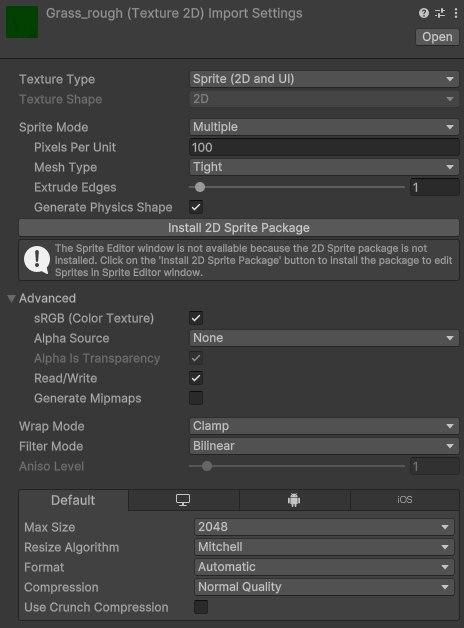

# 贴图导入设置

> 参考 [贴图导入设置(Texture Import Settings)](https://docs.unity3d.com/cn/2023.2/Manual/class-TextureImporter.html) 、 [Sprite (2D and UI) Import Settings reference](https://docs.unity3d.com/cn/2023.2/Manual/texture-type-sprite.html)官方文档。

贴图的导入设置种类很多，主要应用在3D相关的情况，在2D下我们只要学习 [Sprite(2D and UI)](#20250831115115-z0go7o1) 这个类型即可，下面也将会以这项进行展开讲解。

## 参数窗口

## 核心参数

### Texture Type

​`贴图类型` - 用来决定贴图的类型，其他相关选项会根据这个类型进行变化。

#### Default

​`默认` - 如果什么都不选的时候，都是以默认类型进行导入。

#### Sprite(2D and UI)

​`精灵/2D/UI贴图` - 这个是UI中最常使用的贴图类型。

‍

---

## Sprite常用设置

### Sprite Mode

​`精灵模式` - 指定从图像中提取精灵的方法。

#### Single

​`独立` - 直接把图像作为精灵使用。

#### Multiple

​`多个` - 将图像中的多个元素提取出成精灵。可用于切片序列帧图、[Tiles](https://docs.unity3d.com/cn/2023.2/Manual/Tilemap-TileAsset.html) 等等。

#### Polygon

​`多边形` - 可以自定定义轮廓裁切精灵。

### Pixels Per Unit

​`单位像素` - 简称PPU，用于设置默认图像大小的参数设置，根据 [画布缩放器 (Canvas Scaler)](渲染相关/画布组件/画布缩放器%20(Canvas%20Scaler).md) 设置的 `参考单位像素(ReferencePixelsPerUnit)` 计算像素。

### Mesh Type

​`网格类型` - 指定精灵资产的网格类型，属性在 `Single` 和 `Multiple` 下可见。

#### Full Rect

​`全矩` - 就是一个矩形来承载精灵。

#### Tight

​`紧密` - 根据像素的透明度生成网格，小于32*32的图无法设置，自动使用 `全矩` 。

### Extrude Edges

​`挤出边缘` - 给周围留出空间，一般用于打包图集的时候，给图留空隙，避免互相影响。

#### **Pivot**

​`原点` - 用来定图形的原点，或者选 `Custom` 自定义设置。（主要是给 `Sprite Renderer` 组件使用的，UI下一般不用调整的。属性在 `Single`  下可见。

### **Generate Physics Shape**

​`生成物理形状` - 使用图像的轮廓生成物理形状。属性在 `Single` 和 `Multiple` 下可见。

### Open Sprite Editor

​`打开精灵编辑` - 可以设置贴图的分割资产、子资产、定义网格、大小锚点。（一般主要设置九宫格用）

---

## Advanced高级选项

### sRGB

​`伽马空间` - 一般打勾，为非 HDR 颜色纹理（如漫反射和反射颜色）启用此属性。如果要真实的光照计算禁用此属性。

‍
